Mõne kuu eest tuli mul töö juures ette üks huvitav probleem. Huvitav, sest see erineb mu tavalisest tööst ja mulle meeldis seda lahendada. Ja loodetavasti ka huvitav teistel selle kohta lugeda. Tagant järele saan öelda, et selle töö juures lahendamine võttis umbes ühe tööpäeva, aga selle lahtkirjutamine siia blogisse võttis tosina jagu õhtuid kahe kuu jooksul kolmes erinevas riigis. Eesmärk oli see teha lihtsasti loetavaks, et ka mu vanaema saaks midagi aru, aga ma ei ole nii kindel, et see mul õnnestus.

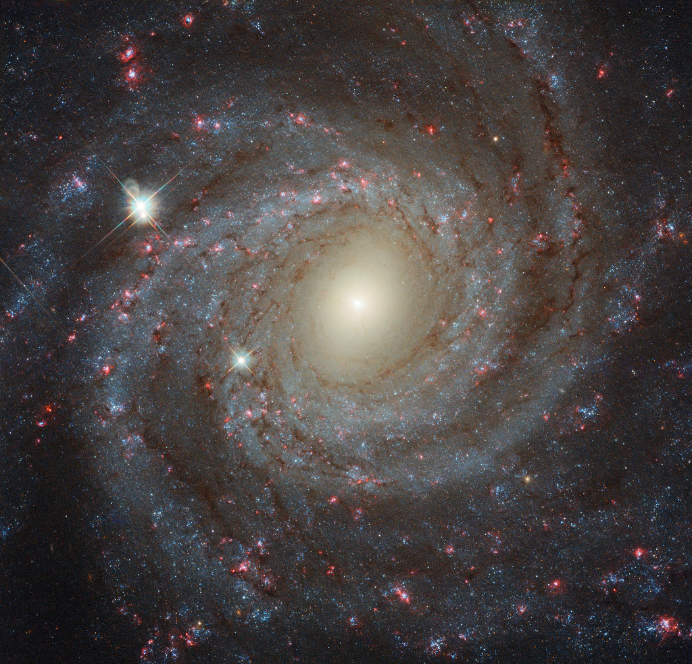{width=75% fig-align="center"}

Ma töötan galaktikatega -- kosmilised objektid, mis koosnevad tähtedest, gaasist ja tumeainest[^galaktika]. Aga mitte päris galaktikatega, vaid arvuti poolt genereeritud galaktikatega. Nendel galaktikatel on see eelis, et me teame väga täpselt, missugune see galaktika on, palju paremini kui vaatlustest teada saab, aga nõrkuseks on see, et me ei saa täitsa kindlad olla, et need on samasugused nagu tõelised galaktikad. Siiski, on kindlaks tehtud, et need arvuti galaktikad on suures pildis päris galaktikatega väga sarnased.

[^galaktika]: Meil on kolleegidega olnud arutelusid, et mis täpsemalt kvalifitseerub galaktikaks. Mõnikord on tähed ja gaas ja tolm, aga puudub tumeaine, mõnel teisel korral on gaas ja tolm ja tumeaine, aga pole ühtegi tähte. Kindlat vastust ei ole.

Tumeaine sarnaneb tavalise ainega, mis on igal pool meie ümber. Aga tumeaine tundub olevat lihtsam. Erinevalt tavalisest ainest, millel on ka elektrilised omadused, on tumeainel ainult mass ja seega on vastastikmõjus ainult gravitatsiooni vahendusel. See tähendab ka näiteks, et tumeaine ei neela ega kiirga valgust, sest see on elektriline protsess. Sellepärast ei ole tumeainet ka teleskoobiga näha, sest tumeaine ei hooli valgusest, aga meie ainult valgust näemegi. Kuid see, et tumeaine hoolib ainult gravitatsioonist, muudab selle arvutis modelleerimise kordades lihtsamaks.

## Probleemi püstitus

Ühel päeval küsiti minult "Kas Linnutee galaktika keskmes olev tumeaine on isotroopse jaotusega?" See tähendab, et kas aine jaotus on kerakujuline või midagi muud, näiteks lapik. Piljardikuulis on näiteks aine jaotus isotroopne ehk igas suunas samasugune, aga kurgi sees mitte, sest see on hoopis piklikuma kujuga.

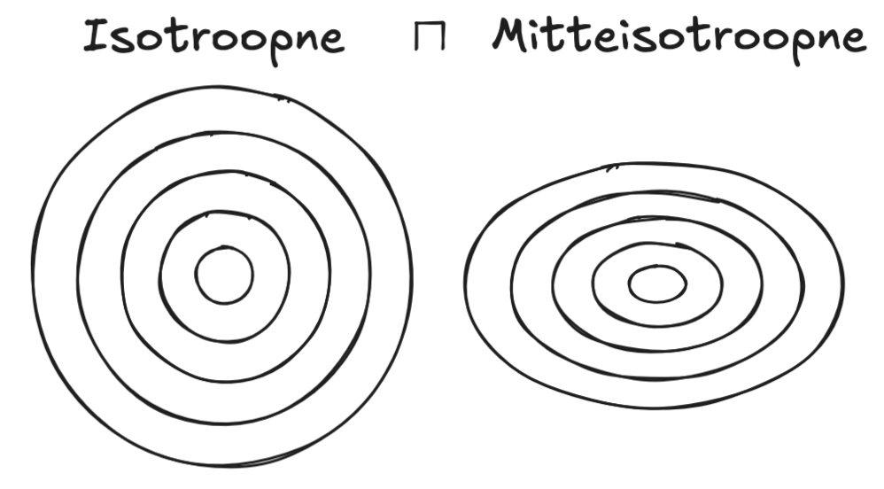{width=70% fig-align="center"}

Mul on arvutis galaktika. See tähendab, et on andmetega fail, mis loetleb selle galaktika osakesi ja nende asukohti. Neid osakesi on miljoneid (11 112 129). Muidugi päriselt on galaktikas aatomeid oluliselt rohkem, aga kõik need ei mahu arvutisse, seega üks osake esindab (väga-väga) suurt kogust massi.

Seega meie keskne küsimus taandub küsimuseks, et kas osakesed on isotroopse jaotusega. Seda on vaja veel lihtsustada. Isotroopsus on alati mingi punkti suhtes. Meie jaoks on see punkt galaktika keskkoht. Lihtsamalt öeldes tähendab isotroopsus keskpunkti suhtes seda, et kui me asume seal keskpunktis ja vaatame ringi, siis kõik suunad näevad samasugused välja. Näiteks, kui me paneksime silmad kinni ja keerutasime ennast umbes täpselt 22 radiaani, siis oleks võimatu öelda, kas me vaatame nüüd samas suunas või mitte, sest kõik näeb samasugune välja. Ja mitteisotroopne siis vastupidi, et kui me vaatame erinevates suundades, siis saame öelda, et me näeme erinvaid asju. Küsime siis hoopis, et kui me oleme Linnutee galaktika keskmes ja vaatame ringi, siis kas on võimalik erinevaid suundi üksteisest eristada?

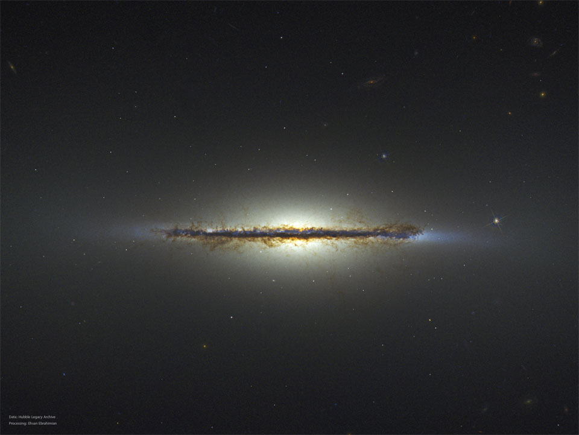{width=80% fig-align="center"}

Erinevalt eelmisest galaktika pildist paistab siin galaktika lapik, sest me vaatame sellele otsa hoopis serviti (nagu siil soovitas). Paljud galaktikad on kettakujulise struktuuriga, kaasa arvatud meie Linnutee galaktika. Seega, kui me oleksime selle galaktika keskpunktis, siis ilmselt meie vaade erineks sõltuvalt sellest, kas me vaatame ketta suunas või risti kettaga ehk rohkem "galaktikast välja". Näiteks, kui sa juhuslikult leiad ennast pilvitul ja ilma Kuuta öösel täiesti valgusreostuseta aasal ja heidad ennast murule ning imetled tähti, siis on taevas selgesti eristatav meie Linnutee galaktika ketas, sest seal suunas paistab rohkem tähti ja tolmu. Galaktikad on tolmused! Muidugi mitte nii tolmused kui kodus kapi taga, aga siiski.

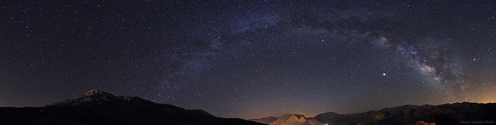

Võime öelda, et gaasi, tolmu ja tähtede jaotus on mitteisotroopne. Aga meie küsimus oli tumeaine kohta. Tumeainet pildi pealt ei paista, sest ta ei hooli valgusest. Teadlased arvavad, et suures pildis on tumeaine galaktikate ümber isotroopne. Keskpunktis on see suurema tihedusega ja mida kaugemale me liigume, seda väiksemaks tihedus muutub, olenemata, kuhu suunas minna, peaasi et keskpunktist kaugemale. Tumeaine kookon on tegelikult galaktikast oluliselt suurem. Neid kookoneid kutsutakse halodeks ja tumeaine halo on tavaliselt galaktikast endast 10-30 korda suurem.

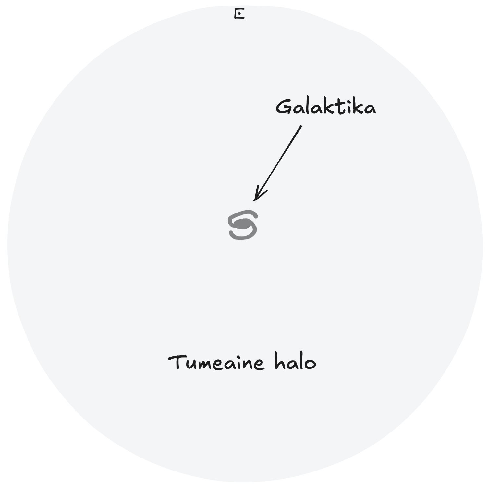{width=75% fig-align="center"}

Aga kuidas saab siis nii olla, et gaas ja tähed on silmnähtavalt mitteisotroopsed, aga tumeaine on ühtlane? Kui ma just mainisin, et teadlased usuvad, et suures pildis on tumeaine jaotus isotroopne, siis sõnapaar "suures pildis" oli selles lauses väga tähtis. Võib-olla samadel skaaladel nagu galaktika ise ehk siis tumeaine halo keskosa ei olegi isotroopne. Selle väljaselgitamine ongi selle väikese eksperimendi mõte.

Kuidas mõõta osakeste isotroopsust? See ei ole nii ilmselge nagu galaktika enda puhul, sest "suures pildis" on tumeaine jaotus ikkagi üpriski isotroopne. Seega meil on vaja midagi paremat kui lihtsalt pealevaatamine. Vaja matemaatika appi võtta.

Alustame eeldusest, et kui tumeaine jaotus ei ole ühtlane igas suunas, siis see vähemalt mingil määral kattub galaktika enda ebaühtlusega. Ehk kui me kontrollime isotroopsust, siis eristame kahte suunda: mööda galaktika ketast ja risti galaktika kettaga. See tundub hea eeldus, sest kui tumeaine jaotus halo keskel on mitteisotroopne, siis tõenäoliselt on see tekitatud galaktika poolt. Galaktika kettas olev gaas ja tähed tõmbavad seda gravitatsiooniga pannkooklikuks[^pannkook]. Sellegipoolest on tähtis meeles hoida, et see on üks meie mudeli eeldustest, mis ei pruugi ilmtingimata õige olla. Aga mul on selle osas hea tunne, seega jätkame praegu selle eeldusega.

[^pannkook]: Üks kosmoloogia teooria, mis kirjeldab galaktikate teket ja seda, miks asjad lapikud on, kutsutaksegi pannkoogi mudeliks ehk *pancake model*.

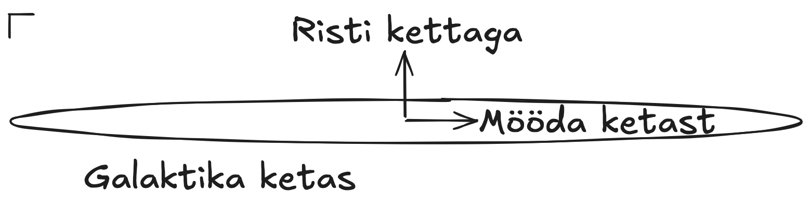{width=80% fig-align="center"}

Meil on olemas nüüd kaks suunda, mille vahel me üritame erinevusi leida. Lihtsustatult öeldes, üleval/all ja kõrvale. Järgmine küsimus on, et mis see erinevus olla võiks. Tumeaine korral palju valikuid ei ole, tal on ainult mass ja asukoht. Arvutame tiheduse! Tihedus on massi ja ruumala suhe ehk matemaatiliselt $\rho = \frac{m}{V}$. Praktikas on tiheduse jaoks meil vaja määrata ruumala ja siis liita kokku kõigi osakeste massid, mis asuvad selle ruumala sees. Suunad on meil juba valitud, seega nüüd on vaja otsutada, missugused ruumalad sobivad neid suundasid esindama. Kuidas valida ruumala, mis tähistab "üleval/all" või "kõrvale" suunda?

![Spiraalgalaktika M81 mitte-päris-serviti, komposiitpilt kosmosest ja Hawaiilt. Allikas: Subaru Telescope, Hubble Space Telescope, Roberto Colombari & Robert Gendler [^difraktsioon]](m81_colombari_1080c.jpg){width=100% fig-align="center"}

[^difraktsioon]: See pilt on pandud kokku kahe erineva teleskoobi piltidest ja see paistab siit ilusti välja. Kui vaadata tähti, mis kaamera sensori oma erksa valgusega ülesäritavad, siis olenevalt teleskoobi sekundaarpeegli konstruktisioonist tuleb erinev difraktsioonipilt. Hubble'i difraktsioon on nelja haruga ja Subaru oma kaheksa haruga.

## Ruumalad

Kõigepealt on meil vaja teada, kuidas galaktika ketas ruumis asetseb, sest simulatsioon on suur, seal on palju galaktikaid ja põhimõtteliselt mitte ükski neist ei ole ilusti serviti meie vaateväljaga, vaid juhusliku nurga all nagu üleval oleval pildil. Ütleme, et ma olin tubli, arvutasin galaktikas olevate osakeste põhjal nende inertsitensori, siis selle omavektorid, mille abil ma leidsin pöördemaatriksi ja siis tegin koordinaatteisenduse, mille lõpptulemuseks ongi meil galaktika, mis on kenasti servapidi meie poole ja galatika ülesse suund ühtib joonise ülesse suunaga. See kuidas see kõik töötab ei ole praegu nii oluline. Tähtis on, et meil on nüüd kenasti ülesrivistatud galaktika, millega me saame tööd teha.

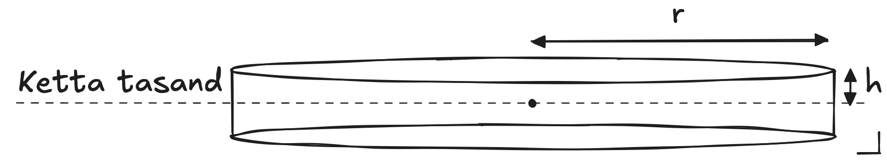

Alustame kõrvale suunast. Kuna galaktikal on ketas, siis me saame määrata ketta tasandi. Ja ütleme, et kõik osakesed, mis on ketta tasandist kaugusel $h$ asuvad kettas. Tegelikult peaks panema külje peale ka mingi piiri ette, muidu meil on lõpmatult suur ketas. Ütleme, et ketas ulatub maksimaalselt kaugusele $r$. Nendel suurustel võiks olla mingid väärtused ka. Kasutame ühikut $\mathrm{kpc}$, mis tegelikult on kiloparsek, aga meie jaoks võib vabalt olla kalaktika pakcuc. Seega saame võtta, et $h=0,\!5\,\mathrm{kpc}$, mis teebki galaktika paksuseks täpselt 1 kalaktika pakcuc. Ja kauguse piiriks paneme praegu näiteks $r=7\,\mathrm{kpc}$.

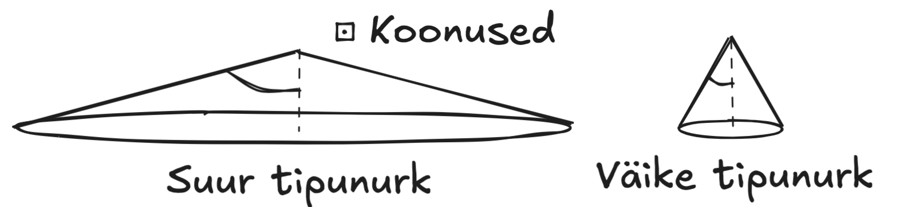{width="80%" fig-align="center"}

Nüüd üles/alla suunad. Galaktika kettatasandi me juba määrasime. Saame määrata ka selle tasandiga risti oleva sirge ehk  matemaatikakeeli tasandi normaali. Nüüd teeme koonuse, mille tipp puudutab galaktika keskpunkti ja koonuse telg ühtib selle ilusa sirgega, mis me just määratlesime. Aga koonuse üheselt määramise jaoks on meil vaja veel ühte parameetrit. See võib olla näiteks tipunurk või kõrguse ja põhjaks oleva ringi raadiuse suhe. Pärast mitut sekundit mõtlemist valime me, et meie koonuse kõrguse ja põhja raadiuse suhe saab olema 1. Sellist koonust kutsutakse ka võrdkülgseks koonuseks ja selle tipunurk (nurk külje ja telje vahel) on 45 kraadi.

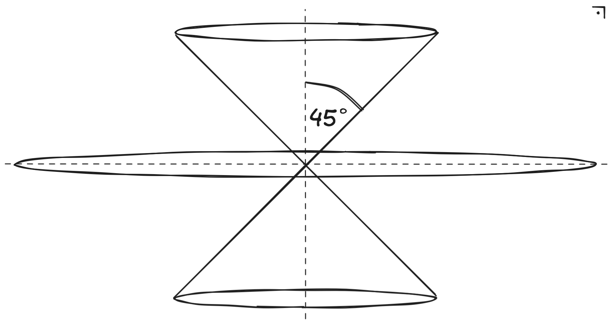{width="70%" fig-align="center"}

Nüüd me saamegi arvutada tihedused ketta suunas ja üles/alla suunas ja neid omavahel võrrelda. Saame kaks arvu ja kui need ei ole võrdsed, siis järelikult erinevad suunad on erinevad ja tumeaine tihedus ei ole isotroopne. Muidugi vaevalt kaks arvu täiesti samad tulevad. Mis siis saab, kui tiheduste erinevus on 1 misiganes-tiheduse-ühikut? Aga siis kui see on 0,1 või 0,00001? Tuleks arvutada ka, et kui suure täpsusega me oleme suutnud need kaks arvu määrata ehk nende arvude määramatused. Aga teate mis? See on keeruline. Võimalusi selle tegemiseks on palju ja võib-olla ma kunagi kirjutan nendest (terve loengukursuse?), aga sel korral püüame mööda hiilida. Teeme hoopis nii, et kahe arvu asemel arvutame neid rohkem. Arvutame tiheduse sõltuvuse kaugusest ehk lisaks praegustele ruumala määratlustele lisame veel ka kauguse vahemikud, mitte ei kasuta ainult maksimaalset kaugust. Niimoodi me saame uurida, kuidas tihedus muutub, mida kaugemale me galaktika keskkohast läheme. Ja sealt pealt näeme, et kui need muutuvad suhtliselt ühtlaselt, siis on meie tihedused piisavalt kenast määratud, määramatus on väike. Kui need tiheduse väärtused muutuvad kaugusega ebaühtlaselt ehk vahepeal on suurem tihedus, siis väiksem, siis suurem, siis väiksem, siis suurem jne, siis selle hajuvuse põhjal saame ka juba hinnata nende väärtuste määramatust. Käib kah. Vast.

Peame otsustama, missugused kaugused meid huvitavad. Alustame lähemast otsast. Kuna simulatsioon ei ole lõpmata täpne ja väikestel skaaladel tehakse lihtsustusi, mis ei ole väga füüsikalised, siis otsustame, et me ei alusta oma arvutusi päris galaktika keskpunktist, vaid näiteks kauguselt $0,\!5\, \mathrm{kpc}$. Ja kuna me teame, et halod suurtel skaaladel on ikkagi suhteliselt isotroopsed, siis teemegi oma analüüsi ainult väikestel skaaladel. Lõpetame näiteks umbes $5\,\mathrm{kpc}$ juures. Me tahame kasutada nii väikest sammu kui võimalik, et meil oleks rohkem infot, aga samas piisavalt suurt sammu, et me ei arvutaks tihedust ainult paari osakese pealt, vaid neid võiks olla ikka korralik peotäis, näiteks 10 000. Kauguse muutumise sammu saab pärast arvutuste käigus muuta.

Tiheduse arvutamiseks tuleb arvutile selgeks teha, et kust ala seest ta osakesi kokku peaks liitma. See on üldjuhul lihtne. Meil on osakese asukoht olemas ja saame kontrollida näiteks, et selle kaugus kettatasandist oleks piisavalt väike ja kaugus keskpunktist sobiks sellesse vahemikku, mille tihedust me praegu arvutame. See ei ole keeruline. Palju põnevam on probleem ruumaladega. Seda me ei saa lihtsalt simulatsioonist.

Alustame sel korral üles/alla suunast, sest see on lihtsam. Esiteks, kuna üles ja alla suunad on täpselt sama ruumalaga, siis arvutame ainult ühe ja kasutame matemaatilist trikki, kus me pärast korrutame selle kahega ja oleme hästi uhked enda üle[^viga1]. Kuna me nüüd uurime tihedusi erinevates kauguste vahemikes ja me vaatame kauguseid keskpunkist, siis need ruumalad tulevad painutatud, nagu kera kihid. Aga meie koonus on sirge lõikega, vähemalt selle põhi. Võib-olla on mõni parem kujund, mida võiks kasutada? See oli retooriline küsimus, muidugi on. Me kasutame hoopis kera sektoreid! Need on nagu sektorid ringist, aga ruumikamad.

[^viga1]: Kui ma seda analüüsi kolleegide jaoks tegin, siis ma tegelikult tegin alguses selle vea, et arvutasin küll massid mõlemalt poolt galaktikad, aga ma unustasin ruumala kahega korrutada ja tihedused tulid valed. Aga keegi ei saa seda kunagi teada.

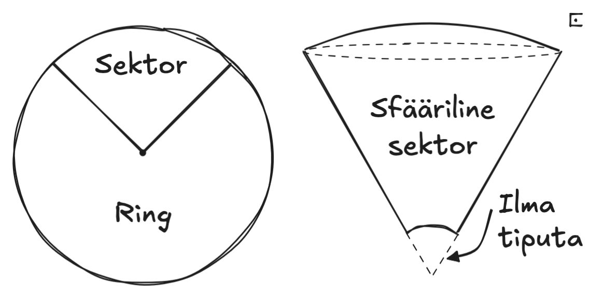{width="80%" fig-align="center"}

Kuna see on nii tavaline kujund, siis selle ruumala arvutamiseks on valem olemas ja me ei peagi ise integraale lahendama. Kera sektori ehk sfäärilise sektori ruumala on $V = \frac{2\pi}{3}r^3(1-\cos\varphi)$, kus $r$ on kera raadius ja $\varphi$ on analoogse koonuse tipunurk, mis meil oli $45^\circ$. Seega saame lihtsustada.

$$
\begin{align*}
V_\text{üleval}(r) &= \frac{2\pi}{3}r^3(1-\cos 45^\circ) \\
&= \frac{2\pi}{3}r^3\left(1-\frac{\sqrt{2}}{2}\right) \\
&= \frac{2\pi}{3}r^3 \ \frac{2-\sqrt{2}}{2} \\
&= \frac{2-\sqrt{2}}{3}\pi r^3.
\end{align*}
$$

See on kogu sfäärilise sektori ruumala, aga kuna me tahame arvutada tihedusi ainult mingis kindlas kauguste vahemikus, siis peame veel natuke vaeva nägema. Kui me oleme otsustanud, mis vahemikud me valime (me veel praegu ei ole seda ära otsustanud), siis me saame endale terve nimekirja raadiuseid. Olgu need $R = \{r_1, r_2, \ldots, r_n\}$ ehk meil on $n$ erinevat raadiust. Kuna me veel ei tea, mitu raadiust me valime, siis kõige suurem raadius on tähistatud lihtsalt $n$ tähega. See $n$ võib analüüsi käigus muutuda, seega praegu seda määrama ei hakka. Aga igatahes on teada, et kui me uurime asju nende raadiuste vahel, siis on meil kokku $n-1$ vahemikku. Näiteks kolme raadiuse korral oleks uurimise all kaks erinevat vahemikku, $r_1$ kuni $r_2$ ja $r_2$ kuni $r_3$. Hoiame ka meeles, et me ei alusta oma arvutusi päris galaktika keskpunktist, seega on selle sektori tipp justkui ära lõigatud. Leiame üldistatud kujul ruumala $i$-ndas vahemikus. Selle jaoks peame arvutama ruumala $r_{i+1}$ ja $r_i$ jaoks ning leidma nende vahe.

$$ V_{\text{üleval},i} = V_\text{üleval}(r_{i+1}) - V_\text{üleval}(r_i) = \frac{2-\sqrt{2}}{3}\pi (r_{i+1}^3 - r_{i}^3). $$

Selle abil saamegi ruumala ja tiheduse arvutada. Peame lihtsalt samas ruumalas olevate osakeste massid kokku liitma (nii ülevalt kui ka alt poolt galaktikat) ja jagama kahekordse ruumala väärtusega, sest me arvutasime ruumala ainult ühel pool galaktikat.

$$ V_{\text{üleval/all},i} = 2 V_{\text{üleval},i} = \frac{2\pi}{3} (2-\sqrt{2}) (r_{i+1}^3 - r_{i}^3). $$

Ja ongi esimene ruumala arvutatud. Šokolaad meile selle eest! 🍫

Järgmiseks tuleb arvutada ruumala galaktika ketta suunal.

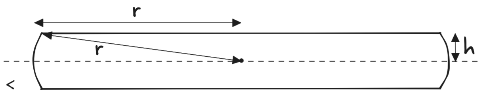

See oli esimene kord üle pika aja, kui mul oli põhjust võtta välja paber ja pliiats ning paberile integraale kirjutada. Alustame mõnedest ilmselgetest asjadest. See ruumala on jällegi sümmetriline ketta tasandi suhtes, seega arvutame ruumala ainult ühe poole jaoks ja korrutame pärast kahega. See tuleb meil hästi välja. Teiseks, tegemist on kettaga ehk lapik silinder. Seega muidugi kasutame integreerimiseks silindrilisi koordinaate. Ja me üritame arvutada ruumala, seega tegemist on kolmekordse integraaliga.

$$ V_\text{ketas}(r) = \int\limits_0^h \int\limits_0^{2\pi} \int\limits_0^{\sqrt{r^2-z^2}} \rho \  \mathrm{d}\rho \,\mathrm{d}\theta \, \mathrm{d}z. $$

See näeb ju täitsa kena välja. Aga nüüd võiks päriselt ruumala ka kätte saada ehk meil on vaja neist integraalidest lahti saada. Ma arvan, et ma jätan sel korral selgitamata, kuidas see integraal tekkis ja kuidas seda lahendada. Aga kui keegi peaks küsima, siis ma teen selle kohta lühikese selgitava postituse. Kuid seniks, vastus tuleb selline.

$$ V_\text{ketas}(r) = \pi\left( r^2h - \frac{h^3}{3} \right). $$

Pärast seda, kui ma selle ära lahendanud olin, leidsin ma, et selle kujundi nimi on sfääriline segment ja selle arvutamiseks on valem olemas. Ehk mul tegelikult ei olnudki vaja integraale lahendada. Ma lihtsalt olin nii vaimustatud mõttest, et saab jälle midagi paberi peal teha ja ei otsinud edasi. Aga see on ka muidugi õppetund sellest, et miks on kasulik kujundite nimesid teada. Interneti ütleb, et sfäärilise segmendi ruumala on

$$ V_\text{sfääriline segment} = \frac{\pi}{6}h (3r_1^2 + 3r_2^2 + h^2), $$

kus $r_1$ on aluseks oleva ringi raadius, $r_2$ ülemise ringi raadius ja $h$ on segmendi kõrgus. Meie juhul on $r_1=r$ ja $r_2 = \sqrt{r^2-h^2}$ ja $h=h$. Seega saame lihtsustada

$$
\begin{align*}
 V_\text{sfääriline segment} &= \frac{\pi}{6}h (3r^2 + 3(r^2-h^2) + h^2) \\
 &= \frac{\pi}{6}h (6r^2 - 2h^2) = \\
 &= \pi \left( r^2h - \frac{h^3}{3} \right). 
 \end{align*}
 $$

Täiesti juhuslikult on see sama, mis oli integraali tulemus. Või siis loodevasti mitte juhuslikult, vaid saatuse tahte. See on väga kasulik, kui saab oma arvutusi kontrollida. Tihtipeale see nii lihtsalt ei käia ja on vaja keerulisemaid meetodeid välja mõelda, et kontrollida, et arvutatud tulemus on mõistlik. Aga sel korral läks hästi. Üks asi veel. Meil on ju vaja ruumala kindlas kauguste vahemikus.

$$
\begin{align*}
V_{\text{ketas},i} &= V_\text{ketas}(r_{i+1}) - V_\text{ketas}(r_i) \\
&= \pi \left( \left( r_{i+1}^2h - \frac{h^3}{3} \right) - \left( r_{i}^2h - \frac{h^3}{3} \right) \right) \\
&= \pi h (r_{i+1}^2 - r_i^2).
\end{align*}
$$

Ja kõigil on ilusti meeles, et see oli ruumala ainult ühel pool ketta tasandit, seega korrutame sellle kahega, et saada kogu kõrvale suuna ruumala.

$$
V_{\text{kõrvale},i} = 2 V_{\text{ketas},i} = 2 \pi h (r_{i+1}^2 - r_i^2).
$$

Teeme vahekokkuvõtte. Meie eesmärk on jätkuvalt uurida, kas tumeaine jaotus galaktika keskmes on isotroopne. Selle jaoks otsustasime arvutada tihedused erinevates galaktika osades ja erinevatel kaugustel, et arvutada asja, mida kutsutakse tihedusprofiiliks. Selle jaoks me valisime välja ruumalad, mis esindavad galaktika ketast (joonisel sinine) ja kettast üleval/all pool olevat ala (joonisel roheline). Need alad on silmnähtavalt erinava suurusega. Sellepärast arvutamegi tihedused, mitte lihtsalt massid. Me arvutasime neile vastavad ruumala. Nüüd on vaja kuidagi öelda arvutile, missuguste osakeste massid ta peaks kokku liitma ja siis saamegi arvutada massi ja ruumala suhted ehk tihedused ning need joonisele panna.

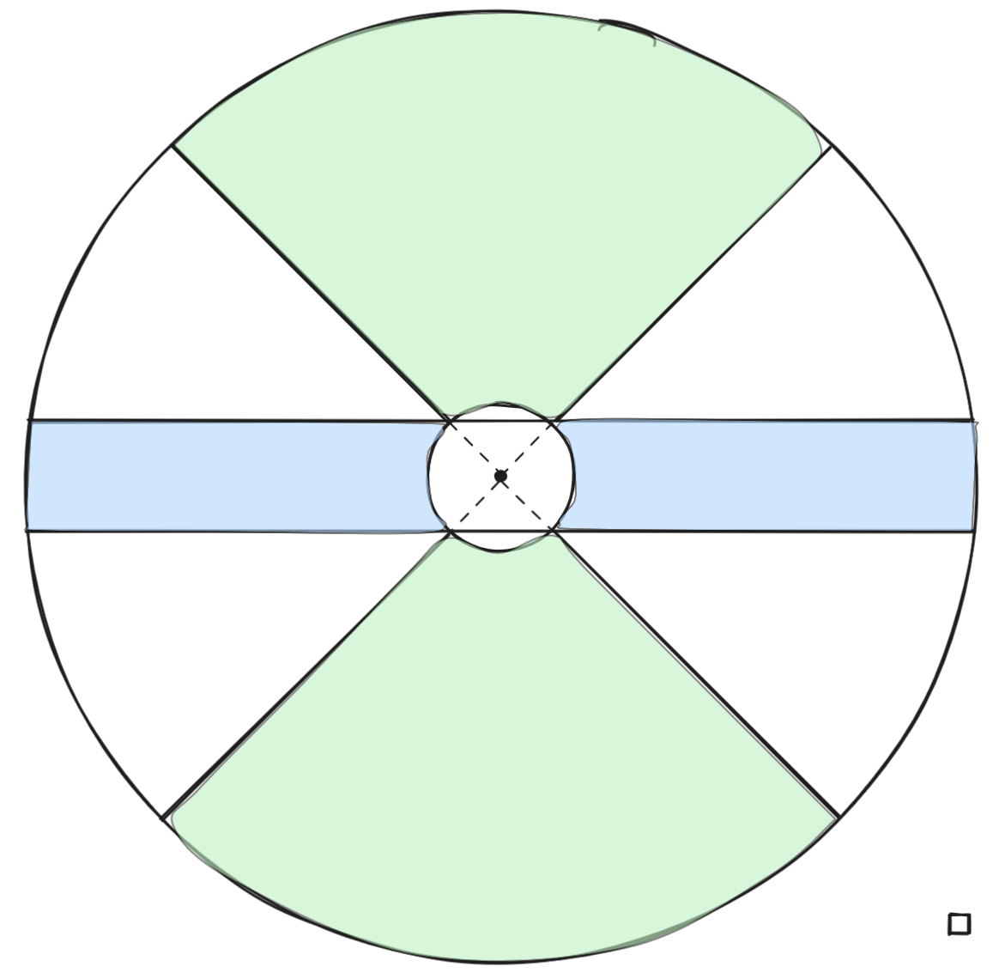{width="60%" fig-align="center"}

## Tihedusprofiilid

Me liigume nüüd paberi ja pliiatsi juurest arvutisse. Meil on seal osakesed koordinaatidega. Me ennist juba tegime trikke, et koordinaatteisendusega liigutada galaktika keskkoht koordinaatidele $(0,0,0)$ ja keerasime galaktika ketta paralleelseks XY tasandiga. Sellisel juhul lähevad kettasse need osakesed, mille korral $z$-koordinaadi absoluutväärtus on väiksem kui meie valitud ketta kõrgus $h$ ehk $|z| \leq h$. Ja osake on meie poolt valitud koonusjas alas kui selle kaugus $z$-teljest on väiksem kui tema $z$-koordinaat ehk $\sqrt{x^2 + y^2} \leq z$. Mõlemal juhul peab kaugus keskpunktist jääma sobivasse vahemikku ehk $r_i \leq \sqrt{x^2 + y^2 + z^2} \lt r_{i+1}$. 

Arvutame tihedusprofiilid!

Teeme kõigepealt lihtsama testi ja ei jaga ruumala veel kaheks osaks, vaid arvutame tiheduse kogu keras sõltuvana kauguest. Massikeskmes on tihedus suurem, sest gravitatsioon tõmbab seda sinna kokku ja mida kaugemale me sellest liigume, sest madalamaks tihedus muutub. Galaktika peaks asuma massikeskmes. Tihedusprofiil võiks välja näha selline.

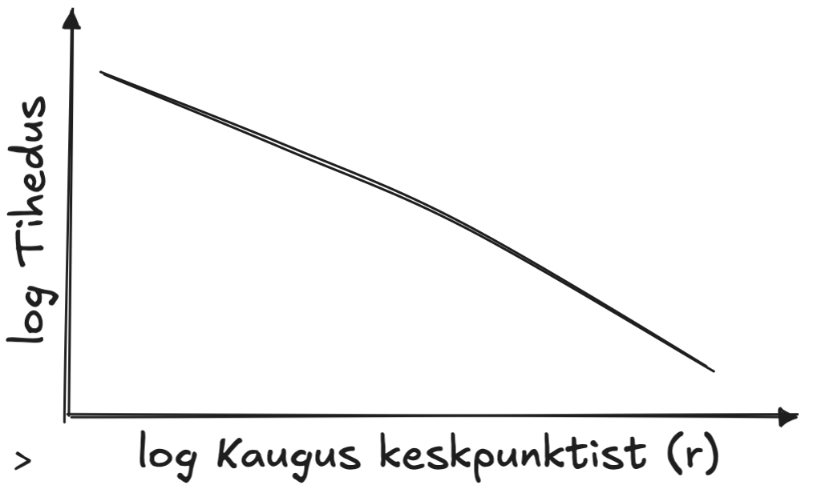{width="80%" fig-align="center"}

Simulatsioonist tuli välja selline.

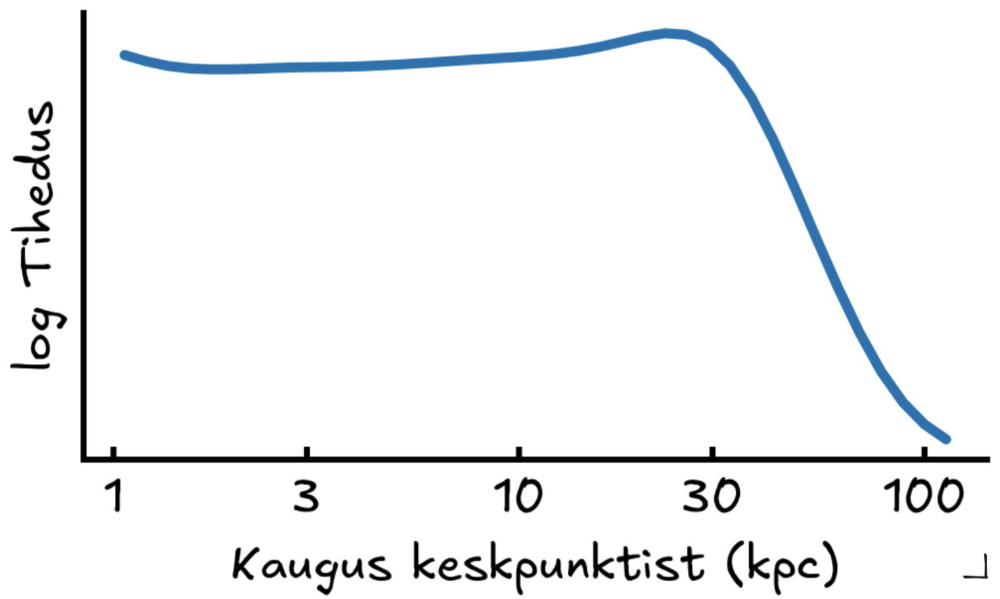{width="80%" fig-align="center"}

Terasem lugeja võib tähele panna, et siin on mingi kala (ingl.k. *bug* -- toimetaja). Tiheduse maksimum peaks olema keskpunktis, aga jooniselt tundub, et tihedus hoopis püsib sama või isegi kasvab pisut, kui me keskpunkist kaugemale liigume ja hakkab kahanema alles $30\,\mathrm{kpc}$ juures. Me oleme teinud kas suure avastuse või väikese vea. Kui esimese korraga asjad välja ei tule, siis tasub võtta samm tagasi ja mõelda, kas eeldused peavad paika ja kui hästi me oma andmeid teame. Joonistame oma galaktika välja.

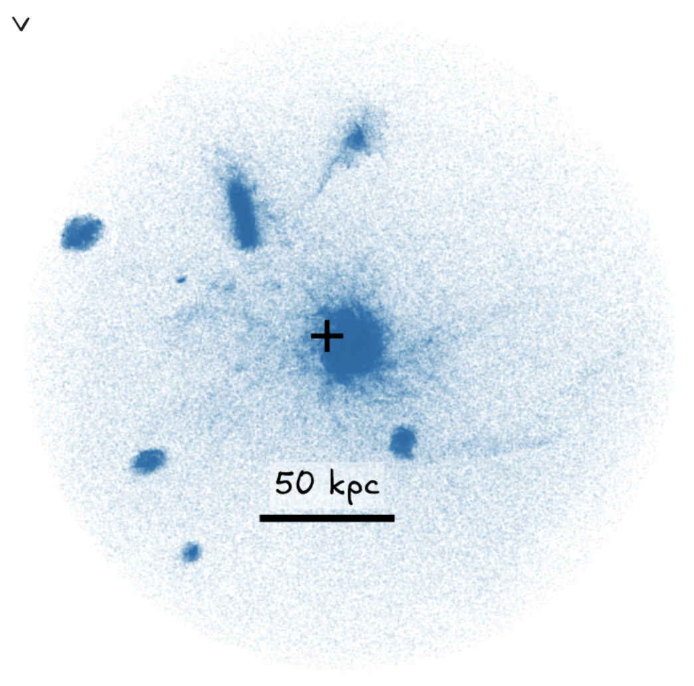{width="80%" fig-align="center"}

Siin ma olen välja joonistanud 10% gaasiosakestest, mis simulatsioonis kuuluvad uuritava galaktika halosse ja panin keskkoha juurde risti ka. Siit on näha, et lisaks põhilisele galaktikale halo keskel on selles halos ka mitu satelliitgalaktikat, millest vähemalt üks on piisavalt massiivne, et mõjutada keskkoha arvutamist. See teine galaktika on selles simulatsioonis olev Suur Magalhãesi Pilv, mis on Linnutee galaktika kõige suurem kaaslane. Kahjuks seda põhjapoolkeralt ei ole näha, aga Miina vast Austraalias kohtas teda öösiti. Minu üks praegustest teadusprojektidest ongi just selle satelliitgalaktika uurimine selle sama simulatsiooni põhjal.

Tagasi meie probleemi juurde. See keskkoht, mida me praegu kasutame, on leitud kogu selle halo põhjal ja tulemus ei päde. Meil on vaja midagi erudeeritumat. Leiame keskkoha iteratiivselt. See tähendab, et kõigepealt kasutame kogu halo, mille raadius on $R$, ja arvutame kõigi osakeste põhjal keskkoha. Seejärel vähendame raadiust poole võrra ja kasutame ainult osakesi, mis on praegusest keskkohast $0.5R$ kaugusel ja leiame uue keskkoha. Me kordame seda kuni kahe järjestikku arvutatud keskkoha väärtused erinevad üksteisest vähem kui mingi piirväärtus $\delta$, mis määrab keskkoha leidmise täpsuse. Vaatame, kuidas meil nüüd keskkoha leidmisega läks.

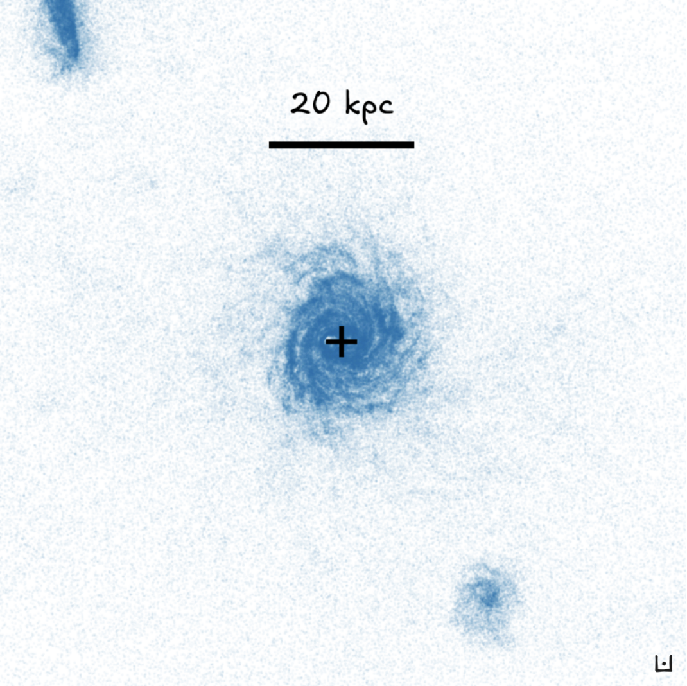{width="80%" fig-align="center"}

Ja serviti ka.

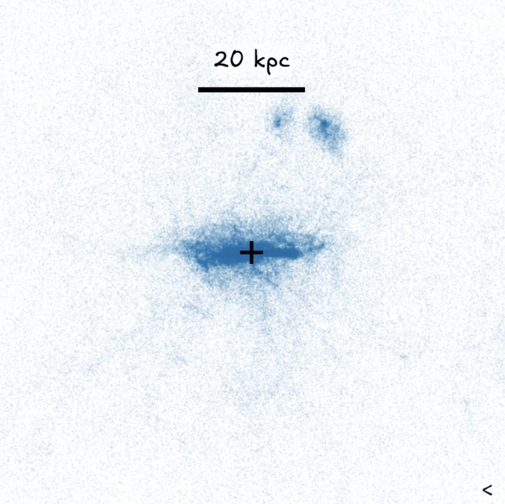{width="80%" fig-align="center"}

Palju parem! Need joonised olid tehtud kasutades gaasiosakesi, mis toovad hästi välja galaktikad, sest seal on gaasi konsentratsioon oluliselt suurem kui mujal. Aga vaatame korra otsa ka tumeainele ehk nendele osakestele, mille jaotust meil on plaanis uurida.

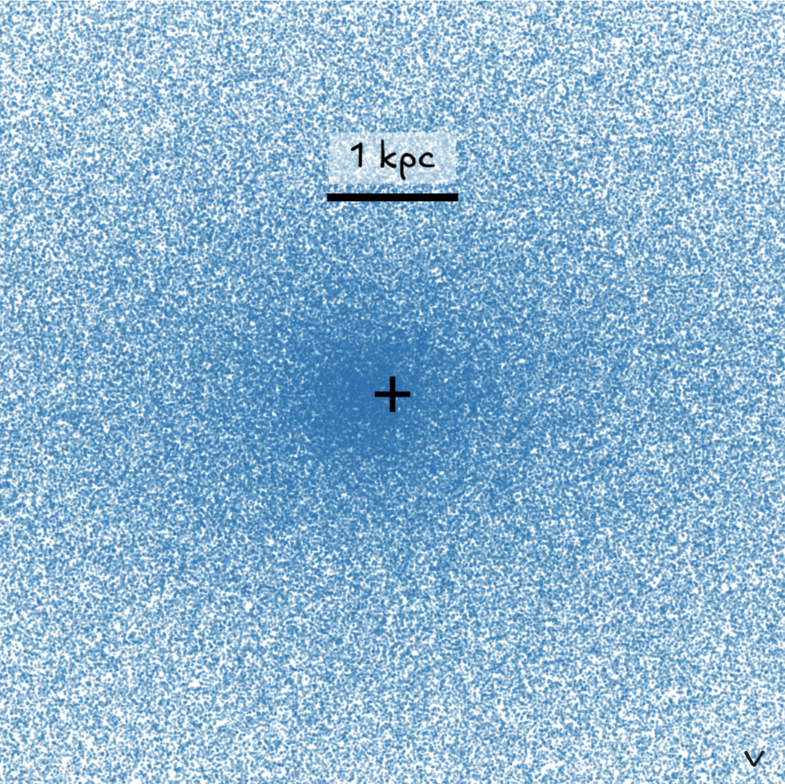{width="80%" fig-align="center"}

See ongi see jaotus, mille kohta meil on vaja öelda, kas see on isotroopne või mitte. Arvutame nüüd tihedusprofiili uuesti, sel korral paremini määratud keskkohaga.

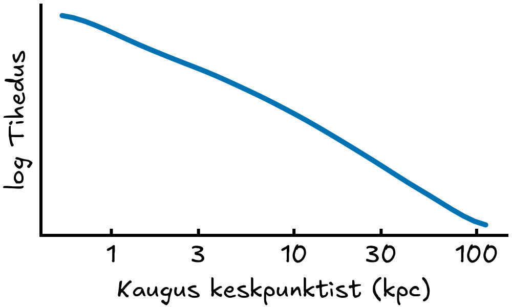{width="80%" fig-align="center"}

Hästi, see on palju sarnasem oodatule. Seega kõik meie (üks) test~~id~~ töötas~~id~~ ja saame edasi analüüsi juurde liikuda. Nüüd jagame ruumalad kaheks osaks ja kontrollime, kas need erinevad või mitte, mis oligi meie esialgne küsimus. Saame sellise joonise.

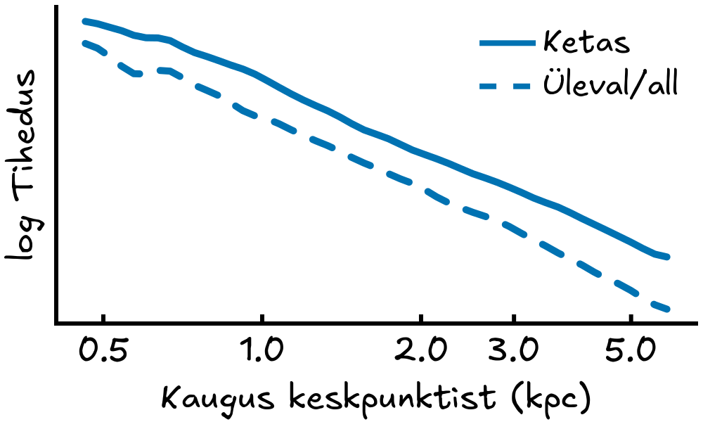{width="80%" fig-align="center"}

Pidev joon näitab tihedust ketta suunal ehk eelneval skeemil sinine ala ja katkendjoon näitab tihedust kettast üleval ja all pool ehk eelneval skeemil roheline ala. Kui teraselt vaadata, siis need on selgelt erinevad ehk tiheduse jaotus on mitte-isotroopne ja meie hüpotees, et tumeaine tihedus on suurem ketta tasandis, pidas paika. Juhhuu! Mul on rohkem kui üks simuleeritud galaktika, mida uurida. Mul on neid rohkem kui ühe käe peal annab kokku lugeda! Teeme joonise kõigi kuue galaktikaga.

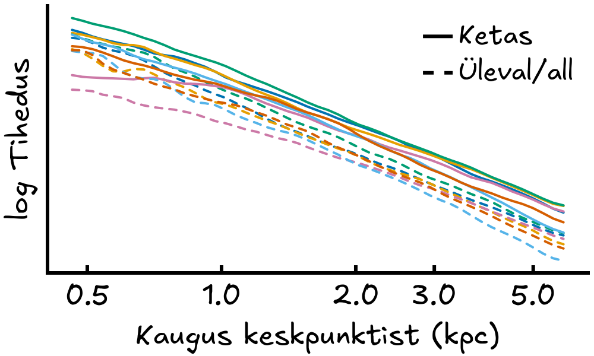{width="80%" fig-align="center"}

Iga galaktika sai oma värvi. Seega kui otsida kaks sama värvi joont, üks pidev, teine katkendlik, siis on näha, et pidev joon on alati kõrgemal ehk iga galaktika korral on tumeaine tihedus ketta tasandis suurem kui kettast üleval ja all. Mida oligi tarvis tõestada (M.O.T.T.) [^mott]. Panen siia juurde ka joonised, mis ma oma kolleegidele saatsin, kui ma seda analüüsi nende jaoks tegin.

[^mott]: Ma pole neid sõnu vist juba 15 aastat kuhugi kirjutanud.

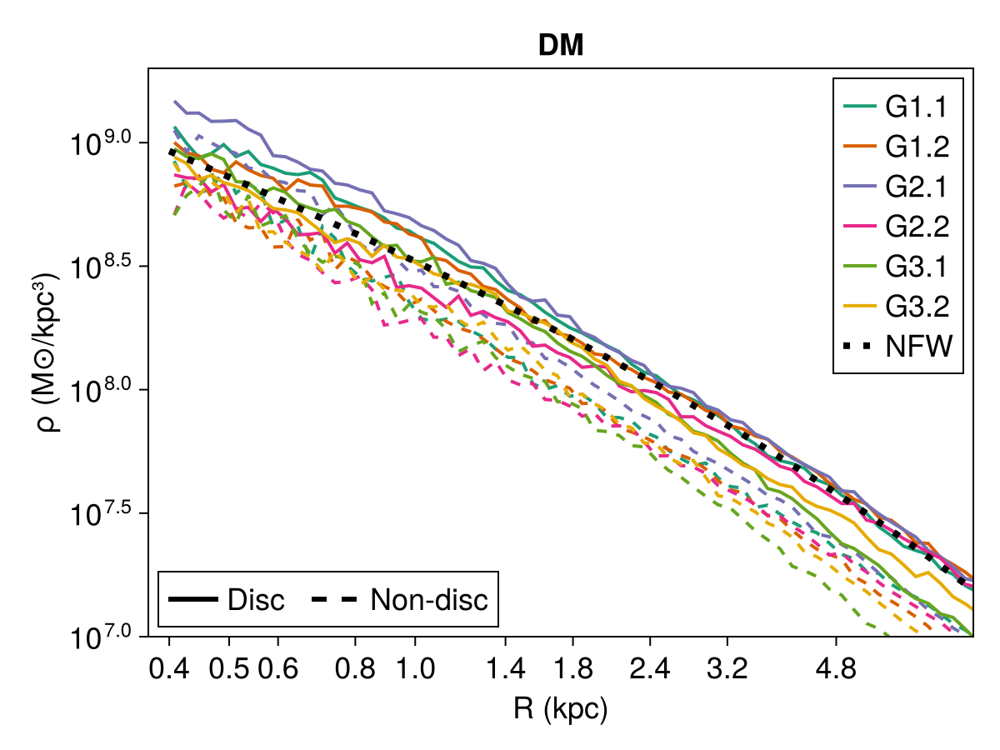
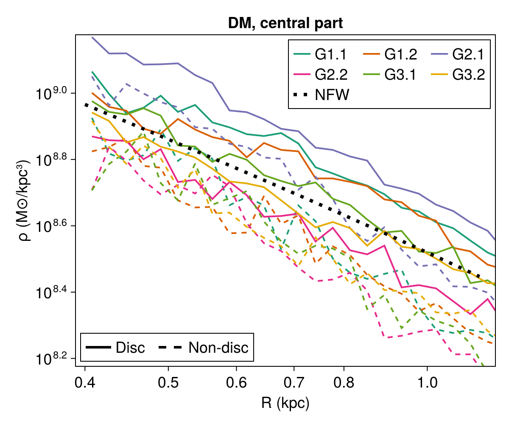

Blogi jaoks tehtud jooniseid ma silusin pisut, et need selgemad välja näeks ja teaduslikule joonisele panin veel ühe võrdlusprofiili, mida kutsutakse NFW profiiliks, aga muus osas peaaegu sama. Teksti šrift on ka erinev. 😉

Kui see tundus palju, siis kogu sellest asjast aru saamine, ise nende probleemide lahendamine ja kirjutamine võiks olla bakalaureusekraadi vääriline. Kraadi saaks kätte küll, aga kõrgema hinde jaoks oleks vaja natuke veel pinguta või oleneb ka muidugi, kui hea kirjuta ja esineja olla.

Kui sa tõesti lugemisega siia lõpuni jõudsid, siis võta see küpsis 🍪! Kui sa lihtsalt kerisid siia lõppu, siis võta omale tass sooja jooki ☕, tõmba tekk ümber, et oleks hea soe olla, ning keri tagasi sinna, kus pooleli jäi.

